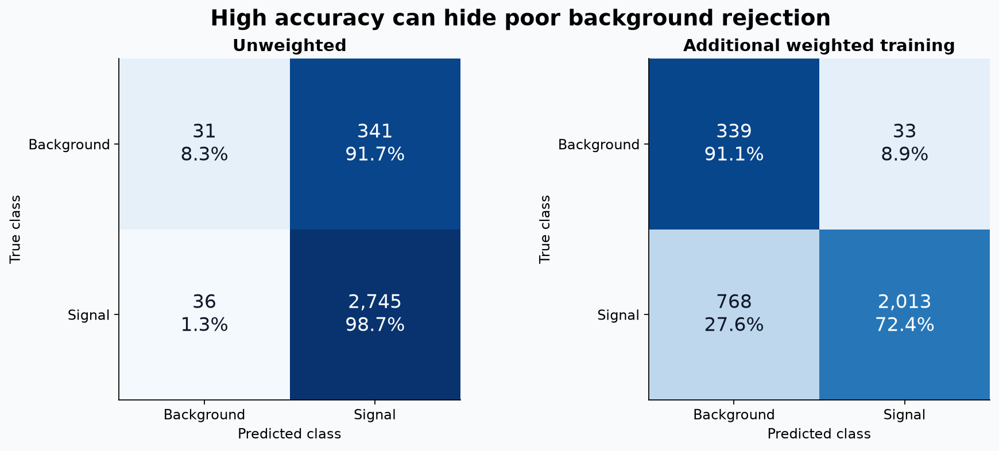

# Neutrino Event Classification

**Chloe Lin · University College London · Python scientific computing**

**When 88% accuracy hides missed background events.**

Developed TensorFlow/Keras CNNs for simulated neutrino interactions and investigated how class imbalance changes signal detection and background rejection (2026).



*Historical test-set counts, redrawn as row-normalised confusion matrices. Additional weighted training improves background rejection at the cost of signal recall.*

**[Start the guided notebook](notebooks/main_analysis.ipynb)** · [Detailed logbooks](notebooks/logbooks) · [Presentation provenance](docs/PRESENTATION_NOTES.md)

## Selected results

### Why is overall accuracy misleading here?

The saved test set contains **2,781 signal events and 372 background events**. The unweighted classifier reaches approximately **88% accuracy**, yet identifies only **31 of 372 background events** correctly. Predicting the majority class can therefore look successful while failing at background rejection.

The opening figure compares the saved confusion matrices, normalised within each true class:

| Saved evaluation | Unweighted | After additional weighted training |
|---|---:|---:|
| Balanced accuracy | **53.5%** | **81.8%** |
| Background rejection | **8.3%** | **91.1%** |
| Signal recall | **98.7%** | **72.4%** |

The later evaluation rejects substantially more background, at the cost of signal recall. **Class-wise metrics expose this trade-off; overall accuracy alone conceals it.** The same network continued training with class weights, so this comparison does not isolate the effect of weighting from additional training.

### How well does the classifier separate signal and background?

The saved ROC curve reports **AUC 0.879** on **3,153 test events**, describing separation across classification thresholds. The confusion-matrix metrics above describe the saved operating point. These are historical coursework outputs, not results from a new training run.

### Supporting investigations

The original [training logbook](notebooks/logbooks/neutrino_classification.ipynb) also examines performance across energy ranges and interaction categories, plus energy regression, flavour classification and interaction-mode classification. These extensions explore where the models struggle; they are not presented as equivalent or independently validated headline results.

## My contribution

This was an individual coursework project. I prepared **21,016 simulated events** from HDF5 files, reshaping each pair of **100 × 80 detector views** into a two-channel CNN input. Using Python and TensorFlow/Keras, I built and trained CNNs for classification and regression, prepared training/validation/test splits, explored class weighting and loss functions, used early stopping in selected models, and evaluated results with task-appropriate metrics.

The shorter guided notebook and opening figure are later portfolio additions. Their relationship to the original work and AI-assisted preparation is documented in [presentation notes](docs/PRESENTATION_NOTES.md).

## Limitations

- These saved results are exploratory. The historical pipeline uses full-dataset pixel normalisation; a corrected evaluation should fit preprocessing on training data only.
- A controlled weighting comparison needs fresh models with the same split and training budget. The saved comparison uses continued training.
- Some supporting experiments need corrections to sample-weight alignment and model reuse before their metrics support stronger conclusions. Details are in [evaluation review notes](docs/REVIEW_NOTES.md).
- Overlapping event topologies may contribute to weaker performance, but these experiments do not establish an intrinsic detector-information limit. Model design, training and data quality are also possible explanations.
- The guided notebook reconstructs metrics from aggregate confusion-matrix counts. It does not retrain a CNN or reproduce AUC from raw prediction scores.

## Acknowledgements and data access

The simulated detector dataset was supplied by the project professor for University College London coursework. **The dataset is not included; redistribution permission has not been established.** Original assignment material and references remain in the detailed logbook; course-provided material is not claimed as an original contribution.

The guided notebook runs without the dataset. See [data access instructions](data/README.md) for authorised local use. Sharing permission for historical detector-image outputs and any course-provided starter material is also unconfirmed.

## Run the guided notebook

From the repository root, create and activate a Python virtual environment, then:

```sh
python -m pip install -r requirements-demo.txt
python -m jupyter lab notebooks/main_analysis.ipynb
```

The short notebook has saved outputs for browsing and runnable cells that regenerate the opening figure. It supports a working directory of either the repository root or `notebooks/`. The original project dependencies are listed separately in `requirements.txt`.

## Repository map

```text
README.md
notebooks/
  main_analysis.ipynb      # Start here
  logbooks/               # Original detailed work
data/                     # Access instructions; no dataset
figures/                  # Generated README figure
docs/                     # Review and provenance notes
requirements-demo.txt      # Guided notebook
requirements.txt           # Original project dependencies
```
